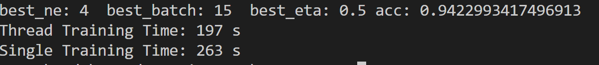

#answer to issue-309

###单进程和多进程超参数优化的实践对比(运行环境i7-8650U)  

####单进程的运行结果

|n_hidden |batch_size| eta | acc  |
|  ----   |   ----   | ----| ---- |
|4        | 10       | 0.1 |0.651 |
|4        | 10       | 0.3 |0.939 |
|4        | 10       | 0.5 |0.941 |
|4        | 10       | 0.7 |0.938 |
|4        | 10       | 0.5 |0.941 |
|4        | 15       | 0.5 |0.942 |
|4        | 20       | 0.5 |0.940 |
|4        | 15       | 0.5 |0.942 |
|6        | 15       | 0.5 |0.937 |
|8        | 15       | 0.5 |0.937 |

####多进程(进程=2)的运行结果  

|n_hidden |batch_size| eta  |acc  |
|   ----  |----     |----   |---- |
|4        |10       |0.1    |0.690|
|4        |10       |0.3    |0.938|
|4        |10       |0.5    |0.940|
|4        |10       |0.7    |0.942|
|4        |10       |0.7    |0.942|
|4        |15       |0.7    |0.940|
|4        |20       |0.7    |0.939|
|4        |10       |0.7    |0.942|
|6        |10       |0.7    |0.940|
|8        |10       |0.7    |0.943|  

运行结果不一致是因为初始化矩阵并不一样，因为分别将其输出在了Single和Thread两个文件夹内。   

|         | 版本    |
|----     | -----   |
|python   | 3.7.3   | 
|joblib   | 0.13.2  |   

原来想使用future.concurrent来实现进程池，后来发现多进程的时候数据计算会出错，也调试不出来，所以就选择了joblib来完成多进程的任务。

